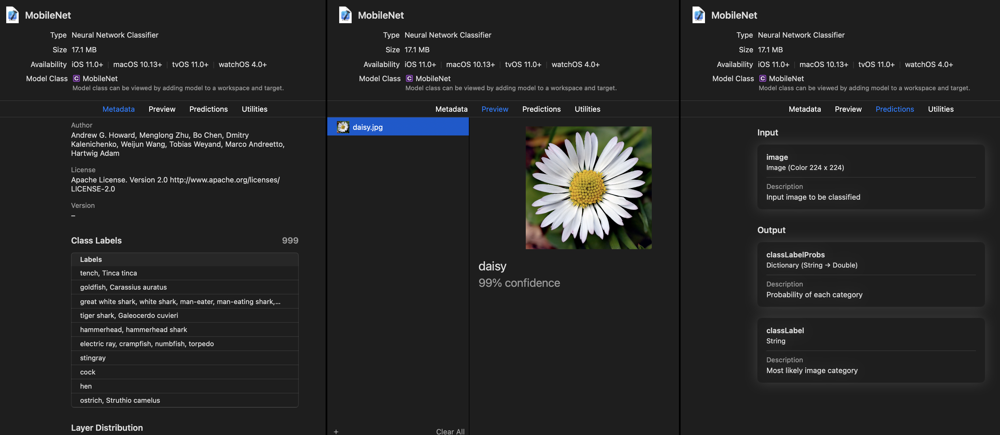

```{eval-rst}
.. index::
    single: classifier; preview and produce
```

# Classifiers

A [classifier](https://deepai.org/machine-learning-glossary-and-terms/classifier) is a special kind of [Core ML](https://developer.apple.com/documentation/coreml) model that provides a class label and class name to a probability dictionary as outputs. This topic describes the steps to produce a classifier model using the [Unified Conversion API](unified-conversion-api) by using the [ClassifierConfig](https://apple.github.io/coremltools/source/coremltools.converters.mil.input_types.html#classifierconfig) class.

## Preview a Classifier Model

Open the classifier model in Xcode. For an image input classifier, Xcode displays the following in its preview:



In the above Xcode preview:

- The **Class labels** section in the **Metadata** tab (the leftmost tab) describes precisely what classes the models are trained to identify.
- The **Preview tab** shows predictions and the associated classes.
- The **Predictions** tab shows top-1 predictions and associated probabilities.
- The **Utilities** tab provides additional utilities for a model consumer and can be encoded into the model during creation. 

```{admonition} Xcode Info

For more information about Xcode model previews, see [Xcode Model Preview Types](xcode-model-preview-types).
```


## Produce a Classifier Model

The code in [Getting Started](introductory-quickstart), repeated below, shows how to add classification labels to your model using the [ClassifierConfig](https://apple.github.io/coremltools/source/coremltools.converters.mil.input_types.html#classifierconfig) class. The classifier model assumes an output corresponding to a probability distribution, and provides the convenience of automatically wrapping the output in dictionary form (class names to probability).

To produce a classifier model, follow these steps:

1. Define the inputs and class labels:
    
	```python
	import coremltools as ct

	# Define the inputs and class labels
	image_input = ct.ImageType(name="image", shape=(1, 224, 224, 3,),)
	classifier_config = ct.ClassifierConfig(class_labels)
	```

2. Convert the model using the [Unified Conversion API](unified-conversion-api):
    
	```python
	# Convert the model using the Unified Conversion API
	model = ct.convert(
		keras_model, inputs=[image_input], classifier_config=classifier_config,
	)
	```

```{eval-rst}
.. index::
    single: PIL
```

3. Use PIL to load and resize the image to the expected size:
    
	```python
	# Use PIL to load and resize the image to expected size
	from PIL import Image
	example_image = Image.open("daisy.jpg").resize((224, 224))
	```

4. Make a prediction using Core ML, and print out the top-1 prediction:
    
	```python
	# Make a prediction using Core ML
	out_dict = model.predict({"image": example_image})

	# Print out top-1 prediction
	print(out_dict["classLabels"])
	```

```{admonition} The Vision Classifier API

All Core ML models use the Core ML framework and its APIs. However, with image input models you can also use the [Vision Classifier Observation API](https://developer.apple.com/documentation/vision/vnclassificationobservation), which provides image analysis and additional convenience features for preprocessing images.
```

```{eval-rst}
.. index::
    single: Vision Classifier Observation API
```

