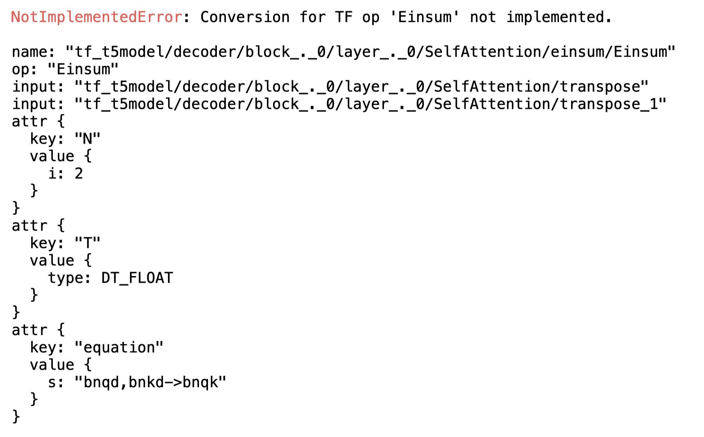

```{eval-rst}
.. index::
    single: composite operators
```

# Composite Operators

As machine learning continually evolves, new operations are regularly added to source frameworks such as [TensorFlow](https://www.tensorflow.org/) and [PyTorch](https://pytorch.org/). While converting a model to [Core ML](https://developer.apple.com/documentation/coreml), you may encounter an unsupported operation.

In most cases, you can handle unsupported operations by using composite operators, which you can construct using the existing MIL operations. For an  overview of MIL operations, see [Model Intermediate Language](model-intermediate-language). 

All of the operations in the MIL Builder class are at your disposal to construct a composite operator. The following example defines a `mb.matmul` operation using the ML Builder to construct a composite operator. It converts the [T5 Model](https://huggingface.co/transformers/model_doc/t5.html?highlight=t5#transformers.T5Model "transformers.T5Model class"), available in the [Transformers library](https://huggingface.co/transformers/ "Transformers").

```{admonition} Install Transformers

You may need to first install [Transformers](https://huggingface.co/transformers/v2.10.0/) version 2.10.0.
```

## Import and Convert the Pre-trained Model

1. Add the import statement and load the pre-trained model:
    
	```python
	from transformers import TFT5Model

	model = TFT5Model.from_pretrained('t5-small')
	```

2. The returned object is an instance of a `tf.keras` model, which you can pass directly into the coremltools converter:
    
	```python
	import coremltools as ct

	mlmodel = ct.convert(model)
	```

3. To simulate a scenario in which coremltools lacks support for an operation, disable the `Einsum` operation needed to convert the model:
    
	```python
	from coremltools.converters.mil.frontend.tensorflow.tf_op_registry import _TF_OPS_REGISTRY

	del _TF_OPS_REGISTRY["Einsum"]
	```

4. Run the conversion. The following error occurs, indicating an unsupported TensorFlow operation:




```{eval-rst}
.. index::
    single: MIL operators
```

## Decompose into Existing MIL Operators

The TensorFlow [documentation on Einsum](https://www.tensorflow.org/api_docs/java/org/tensorflow/op/core/Einsum) refers to Einstein summation notation. You can use this notation to represent a variety of tensor operations such as `reduce_sum`, `transpose`, and `trace`, using a string. Einsum is usually a complicated operation, but with this example you don't need to know all the possible cases, just the particular notation that this model uses. 

The error trace shows that the model uses the following notation for Einsum:

```{image} images/first_eq_300.png
:alt: Notation for Einsum
:align: center
:width: 400px
:class: imgnoborder
```

---

The above notation translates into the following mathematical expression:

```{image} images/second_eq_300.png
:alt: Math expression
:align: center
:width: 600px
:class: imgnoborder
```

---

While the above may look complicated, it is essentially a batched matrix multiplication with a transpose on the second input:

```{image} images/third_eq_300.png
:alt: Batched matrix multiplication
:align: center
:class: imgnoborder
```

---

You can decompose this operation with existing MIL operators. In fact, MIL supports this operation directly. To write a composite for this operation, follow these steps:

1. Import MIL builder and a decorator:
    
	```python
	from coremltools.converters.mil import Builder as mb

	from coremltools.converters.mil import register_tf_op
	```

2. Define a function with the same name as the TensorFlow operation. For this example, this is `Einsum`. To define the function, grab inputs and define a `matmul` operation using the MIL builder:
    
	```python
	@register_tf_op
	def Einsum(context, node):
	
		assert node.attr['equation'] == 'bnqd,bnkd->bnqk'

		a = context[node.inputs[0]]
		b = context[node.inputs[1]]

		x = mb.matmul(x=a, y=b, transpose_x=False, 
					  transpose_y=True, name=node.name)

		context.add(node.name, x)
	```
	
    ```{admonition} Register the Function
    Be sure to decorate this function to register it with the converter, as shown in the above code for TensorFlow (`@register_tf_op`). The decoration ensures that the user-defined function will be invoked whenever an Einsum operation is encountered during the conversion. The corresponding decorator for PyTorch is `@register_torch_op`.
    ```

3. With composite operation for Einsum defined, call the Core ML converter again and print `mlmodel`. This verifies that the conversion is completed, and implies that the unsupported operation error is resolved:
    
	```python
	mlmodel = ct.convert(model)
	print(mlmodel)
	```

## Using Composite Ops with PyTorch Conversion

For PyTorch, use the following import statement:

```python
# example pytorch composite op

from coremltools.converters.mil.frontend.torch.torch_op_registry import 
     _TORCH_OPS_REGISTRY, register_torch_op
from coremltools.converters.mil.frontend.torch.ops import _get_inputs
from coremltools.converters.mil import Builder as mb

  
del _TORCH_OPS_REGISTRY["selu"] # only required if over-writing an existing translation
  
@register_torch_op
def selu(context, node):
    x = _get_inputs(context, node, expected=1)[0]
    x = mb.elu(x=x, alpha=1.6732632423543772)
    x = mb.mul(x=x, y=1.0507009873554805, name=node.name)
    context.add(x)

model = ct.convert(....)
```

## More Examples

For more examples, see the translation code for the supported [TensorFlow ops](https://github.com/apple/coremltools/blob/5c6bec6f20368d474dbcd29b3836acc2c62c933c/coremltools/converters/mil/frontend/tensorflow/ops.py "coremltools/coremltools/converters/mil/frontend/tensorflow/ops.py ") and [PyTorch ops](https://github.com/apple/coremltools/blob/5c6bec6f20368d474dbcd29b3836acc2c62c933c/coremltools/converters/mil/frontend/torch/ops.py "coremltools/coremltools/converters/mil/frontend/torch/ops.py").

