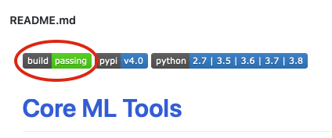

# Installing Core ML Tools

This page describes how to install the [`coremltools`](https://github.com/apple/coremltools "coremltools repository on GitHub") Python package on macOS (10.13+) and Linux.

```{admonition} Supported Python and MacOS Versions

The current version of coremltools ([version 8.0](https://github.com/apple/coremltools)) includes wheels for Python 3.7, 3.8, 3.9, 3.10, 3.11, and 3.12. The last stable release of coremltools to support Python 2 is version 4.0.

The supported MacOS versions are as follows:

- Core ML Tools 4.1 supports macOS 10.13 and newer.
- Core ML Tools 5, 6, and 7 support macOS 10.15 and newer.
```

## Prerequisites

```{admonition} For Beginners

If you are using macOS, you should already be familiar with the [Mac Terminal app command line](https://developer.apple.com/library/archive/documentation/OpenSource/Conceptual/ShellScripting/CommandLInePrimer/CommandLine.html#//apple_ref/doc/uid/TP40004268-CH271-BBCBEAJD "Command Line Primer") to perform tasks such as installations and updates. If you are using Linux, you should already be familiar with [basic Shell commands in Linux](https://www.geeksforgeeks.org/basic-shell-commands-in-linux/).
```

Before installing coremltools, you need [Python](https://www.python.org/downloads/ "Python Downloads") and the [`pip`](https://pip.pypa.io/en/stable/) installer. 

The `coremltools` package supports [Python 3](https://www.python.org/download/releases/3.0/). We recommend that you install Python 3.6 or newer. Use a Python package manager such as [Conda](https://docs.conda.io/en/latest/index.html) or [venv](https://docs.python.org/3/library/venv.html) to install the newest version of Python and other dependencies. [Conda](https://docs.conda.io/en/latest/index.html) is recommended because it is the most reliable way to install all required dependencies.

## Install or Build Core ML Tools

To install Core ML Tools, use one of the following methods:

- The Conda package installer: Python is installed automatically. You can install [`pip`](https://pip.pypa.io/en/stable/) after setting up the Conda environment. Skip to [Set Up Conda](#set-up-conda).
- A virtual environment: Install [`pip`](https://pip.pypa.io/en/stable/), and then use [`venv`](https://docs.python.org/3/library/venv.html), which also installs Python. Skip to [Set Up a New Virtual Environment](#set-up-a-new-virtual-environment).
- Install a Python wheel: To download and install the most recent (or any available) Python wheel (`.whl` file) for Core ML Tools, see [Install From Source](#install-from-source).
- Build from source: To build the most recent (or any available) version of Core ML Tools, see [Build From Source](#build-from-source).

To install third-party frameworks, libraries, or other software, see [Install Third-party Packages](#install-third-party-packages).

## Set Up Conda

Follow these steps:

1. Use the appropriate [Miniconda installer](https://docs.conda.io/en/latest/miniconda.html) for your operating system.

2. Create a Conda environment for `coremltools` using the following command:

```shell
conda create --name coremltools-env
```

3. Activate your virtual environment using the following command:

```shell
conda activate coremltools-env
```

4. Install `pip` for this environment using the following command:

```shell
conda install pip
```

5. Follow the instructions in [Install Core ML Tools](#install-core-ml-tools).

## Set Up a New Virtual Environment

Follow these steps:

1. Install `pip` using the following command:

```shell
python -m pip install --user --upgrade pip
```

2. Create a virtual environment using the following command:

```shell
python -m venv coremltools-venv
```

3. Activate the virtual environment:

```shell
source coremltools-venv/bin/activate
```

4. Follow the instructions in [Install Core ML Tools](#install-core-ml-tools). 

## Install Core ML Tools

Use the following command to install or upgrade to [version 7.1](https://github.com/apple/coremltools) of Core ML Tools:

```shell
pip install -U coremltools
```

## Install Third-party Packages

Install the third-party source packages for your conversions (such as [TensorFlow](https://www.tensorflow.org "TensorFlow") and [PyTorch](https://pytorch.org "PyTorch")) using the package guides provided for them. The `coremltools` package does _not_ include the third-party source packages.

## Install From Source

The continuous integration (CI) system linked to the `coremltools` repo builds a [Python wheel](https://pypi.org/project/wheel/) from the master branch whenever a commit is merged. To get the latest updates to the code base, you can get this wheel from the CI job and install it.

To access the wheel for a particular `coremltools` release, follow these steps:

1. Go to the [`coremltools` repository](https://github.com/apple/coremltools) on GitHub, scroll down to the **README.md** heading, and click the **build passing** button. The **Branches** tab appears:
    
    
    
    

2. Click the **passed** button to show the **Pipeline** tab:
    
    

3. Click a wheel in the **Build** column. For example, in the previous figure, the **build_wheel_macos_py38** wheel is highlighted for clicking. After clicking a wheel, the raw job log appears, with the **Download** and **Browse** buttons in the right column:
    
    

4. Click the **Download** button to download the `dist` folder with the wheel files.

5. Install a wheel file using `pip`. For example, use the following command to install the `coremltools-4.0-cp38-none-macosx_10_12_intel.whl` wheel file for the 4.0 version of Core ML Tools:

```shell
pip install coremltools-4.0-cp38-none-macosx_10_12_intel.whl
```

## Build From Source

To build Core ML Tools and its dependent libraries from source, you need to install [CMake](https://cmake.org/) to configure the project.

To perform the build, fork and clone the [`coremltools` repository](https://github.com/apple/coremltools) and run the [`build.sh`](https://github.com/apple/coremltools/blob/master/scripts/build.sh) script:

```shell
zsh -i scripts/build.sh
```

The script creates a new `build` folder with the coremltools distribution, and a `dist` folder with Python wheel files.

For more information about building Core ML Tools, see [Building From Source](https://github.com/apple/coremltools/blob/master/BUILDING.md).

## Upgrade Core ML Tools

For either Conda or virtual environments, see [Install Core ML Tools](#install-core-ml-tools) for the command to upgrade Core ML Tools.
