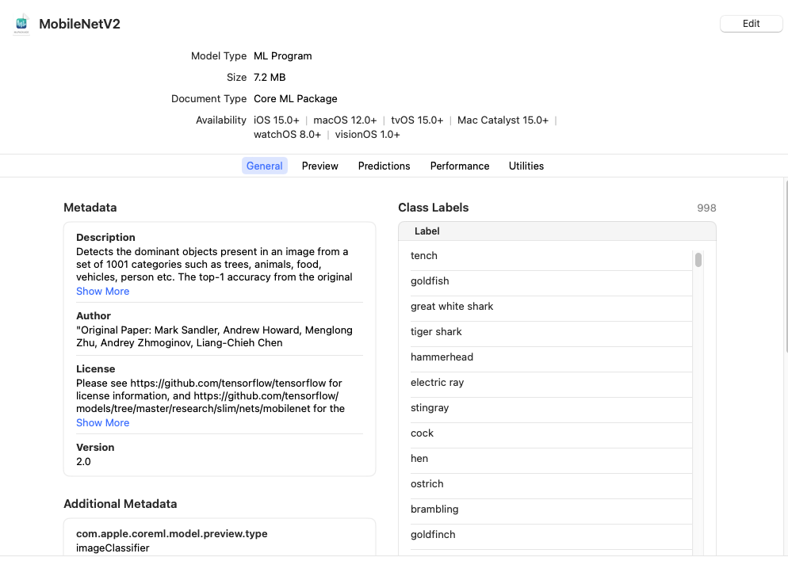
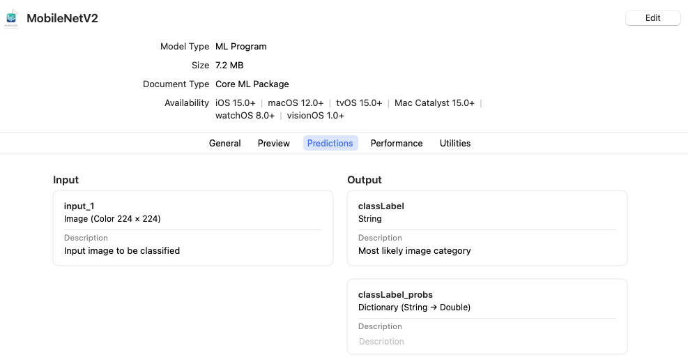
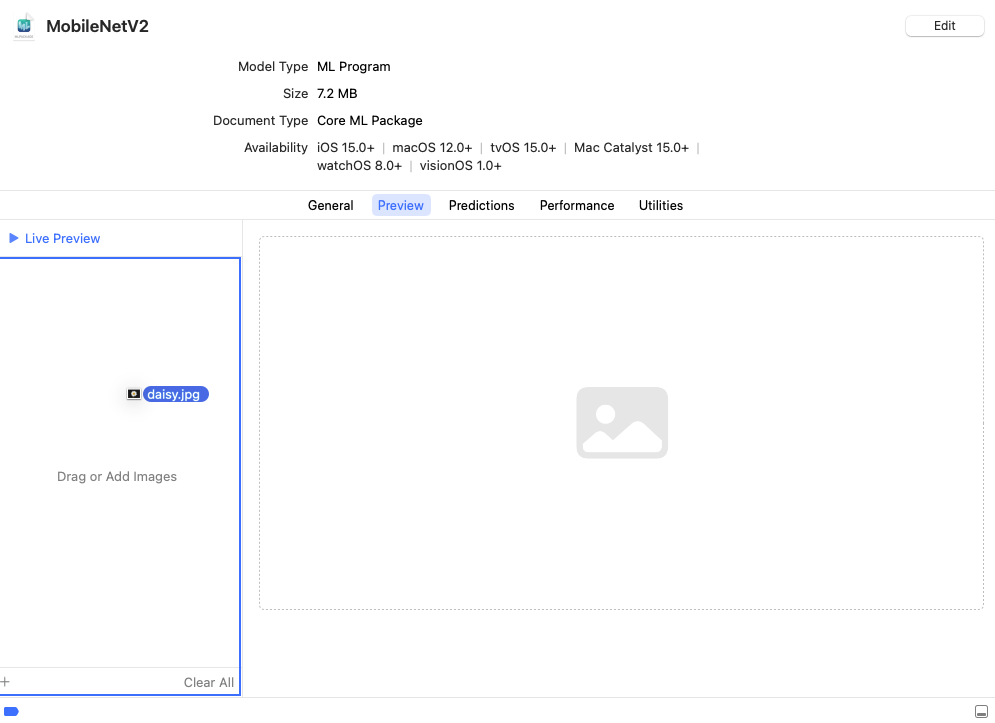
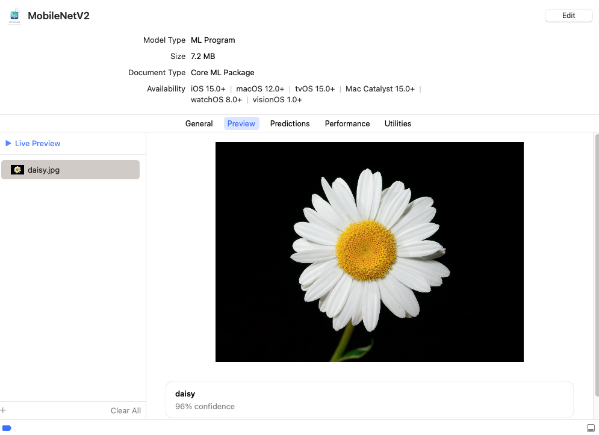

# Getting Started

Core ML Tools can convert trained models from other frameworks into an in-memory representation of the Core ML model. This example demonstrates how to convert an [image classifier model](https://developer.apple.com/documentation/createml/creating_an_image_classifier_model "Creating an Image Classifier Model") trained using [TensorFlow's Keras API](https://www.tensorflow.org/api_docs/python/tf/keras "Module: tf.keras") to the Core ML format.

During the course of this example you will learn the following:

- How to create a model with the [MobileNetV2 architecture](https://arxiv.org/abs/1801.04381 "MobileNetV2: Inverted Residuals and Linear Bottlenecks"), similar to the model hosted on [Apple's model gallery](https://developer.apple.com/machine-learning/models/ "Core ML Models").

- How to use the converted model in the [sample code for classifying images](https://developer.apple.com/documentation/vision/classifying_images_with_vision_and_core_ml "Classifying Images with Vision and Core ML") using the [Vision framework](https://developer.apple.com/documentation/vision "Vision framework"). 

```{note}
The sample model was trained on the [ImageNet](http://www.image-net.org "ImageNet") dataset. It can classify images from a set of [1000 predefined image categories](http://image-net.org/challenges/LSVRC/2014/browse-synsets "ImageNet Large Scale Visual Recognition Challenge 2014 (ILSVRC2014)").
```

In this example, you will do the following:

- [Download the model](#download-the-model) and ensure that the model interface is set correctly for image inputs and classifier outputs.
- [Convert the model](#convert-the-model) from TensorFlow 2 to the Core ML format.
- [Set the model metadata](#set-the-model-metadata) to take advantage of Xcode preview and other Xcode features.
- [Make predictions](#make-predictions) using the model (on macOS), to verify that the conversion is correct.
- [Save and load the model](#save-and-load-the-model).
- [Use the model with Xcode](#use-the-model-with-xcode) to incorporate the model into your app.

## Prerequisites

To run this example, you need version 2.2.0 of TensorFlow and version 2.10.0 of H5PY. Use the following commands to install them:

```shell
pip install tensorflow==2.2.0 h5py==2.10.0 coremltools pillow
```

## Download the Model

Download the previously trained [MobileNetV2](https://www.tensorflow.org/api_docs/python/tf/keras/applications/mobilenet_v2 "Module: tf.keras.applications.mobilenet_v2") model, which is based on the [tensorflow.keras.applications](https://www.tensorflow.org/api_docs/python/tf/keras/applications "Module: tf.keras.applications") API:

```python
import tensorflow as tf # TF 2.2.0

# Download MobileNetv2 (using tf.keras)
keras_model = tf.keras.applications.MobileNetV2(
    weights="imagenet", 
    input_shape=(224, 224, 3,),
    classes=1000,
)
```

Retrieve the class labels from a separate file, as shown in the example below. These class labels are required for your application to understand what the predictions refer to, and are often provided separately in popular machine learning frameworks.

```python Python
# Download class labels (from a separate file)
import urllib
label_url = 'https://storage.googleapis.com/download.tensorflow.org/data/ImageNetLabels.txt'
class_labels = urllib.request.urlopen(label_url).read().splitlines()
class_labels = class_labels[1:] # remove the first class which is background
assert len(class_labels) == 1000

# make sure entries of class_labels are strings
for i, label in enumerate(class_labels):
  if isinstance(label, bytes):
    class_labels[i] = label.decode("utf8")
```

Now that the model is loaded and the class labels are collected, you can convert the model to Core ML.

```{tip}
Before converting the model, a good practice for improving device performance is to know in advance the types and shapes, and to consider the model's interface, including the names and types of inputs and outputs. For this example, the application is an image classifier, and therefore the model's input is an `ImageType` of a specified size. When using inputs of an `ImageType`, it is also important to find out how the model expects its input to be preprocessed or normalized.
```

```{eval-rst}
.. index:: 
    single: ML program; convert image classifier
```

## Convert the Model

Use the following code to convert the model to Core ML with an image as the input, and the class labels baked into the model:

```python
import coremltools as ct

# Define the input type as image, 
# set pre-processing parameters to normalize the image 
# to have its values in the interval [-1,1] 
# as expected by the mobilenet model
image_input = ct.ImageType(shape=(1, 224, 224, 3,),
                           bias=[-1,-1,-1], scale=1/127)

# set class labels
classifier_config = ct.ClassifierConfig(class_labels)

# Convert the model using the Unified Conversion API to an ML Program
model = ct.convert(
    keras_model, 
    inputs=[image_input], 
    classifier_config=classifier_config,
)
```

The Unified Conversion API [`convert()`](https://apple.github.io/coremltools/source/coremltools.converters.convert.html#module-coremltools.converters._converters_entry "Unified Conversion API") method in the previous example produces an [ML program](convert-to-ml-program) model.

If you include the `convert_to="neuralnetwork"` parameter, the method produces a neural network with the  `neuralnetwork` model type. The following is the same code as the above example, using the `convert_to` parameter in `convert()`:

```python
import coremltools as ct

# Define the input type as image, 
# set pre-processing parameters to normalize the image 
# to have its values in the interval [-1,1] 
# as expected by the mobilenet model
image_input = ct.ImageType(shape=(1, 224, 224, 3,),
                           bias=[-1,-1,-1], scale=1/127)

# set class labels
classifier_config = ct.ClassifierConfig(class_labels)

# Convert the model using the Unified Conversion API to a neural network
model = ct.convert(
    keras_model, 
    convert_to="neuralnetwork",
    inputs=[image_input], 
    classifier_config=classifier_config,
)
```

```{admonition} ML Programs vs. Neural Networks

To learn the differences between the newer ML Program model type and the neural network model type, see [Comparing ML Programs and Neural Networks](comparing-ml-programs-and-neural-networks).
```

```{eval-rst}
.. index:: 
    single: metadata; TensorFlow model
    single: TensorFlow; set model metadata
    single: ML program; set model metadata
```

## Set the Model Metadata

After converting the model, you can set additional metadata for the model in order to take advantage of Xcode features:

- Xcode can display a **Preview** tab of the model’s output for a given input. The classifier model for this example does not need further metadata to display the **Preview** tab. For other examples, see [Xcode Model Preview Types](xcode-model-preview-types).
- Xcode can show descriptions of inputs and outputs as code comments for documentation, and display them under the **Predictions** tab. 
- Xcode can also show additional metadata (such as the license and author) within the Xcode UI.

```python Python
# Set feature descriptions (these show up as comments in XCode)
model.input_description["input_1"] = "Input image to be classified"
model.output_description["classLabel"] = "Most likely image category"

# Set model author name
model.author = '"Original Paper: Mark Sandler, Andrew Howard, Menglong Zhu, Andrey Zhmoginov, Liang-Chieh Chen'

# Set the license of the model
model.license = "Please see https://github.com/tensorflow/tensorflow for license information, and https://github.com/tensorflow/models/tree/master/research/slim/nets/mobilenet for the original source of the model."

# Set a short description for the Xcode UI
model.short_description = "Detects the dominant objects present in an image from a set of 1001 categories such as trees, animals, food, vehicles, person etc. The top-1 accuracy from the original publication is 74.7%."

# Set a version for the model
model.version = "2.0"
```

For a detailed example, see [Integrating a Core ML Model into Your App](https://developer.apple.com/documentation/coreml/integrating_a_core_ml_model_into_your_app "Integrating a Core ML Model into Your App").

## Make Predictions

To verify the conversion programmatically, Core ML Tools provides the `predict()` API method to evaluate a Core ML model. This method is only available on macOS, as it requires the Core ML framework to be present.

```{note}

Core ML models can be [imported and executed with TVM](https://tvm.apache.org/docs/tutorials/frontend/from_coreml.html), which may provide a way to test Core ML models on non-macOS systems.
```

Compare predictions made by the converted model with predictions made by the source model:

```{figure} images/daisy.jpg
:alt: Test image daisy.jpg
:align: center
:class: imgnoborder

An example test image (`daisy.jpg`). Right-click and choose **Save Image** to download.
```


```python Python
# Use PIL to load and resize the image to expected size
from PIL import Image
example_image = Image.open("daisy.jpg").resize((224, 224))

# Make a prediction using Core ML
out_dict = model.predict({"input_1": example_image})

# Print out top-1 prediction
print(out_dict["classLabel"])
```

```{note}

You may find differences between predictions on macOS and your target platform (such as iOS or watchOS), so you still need to verify on your target platform. For more information on using the predict API, see [Model Prediction](model-prediction).
```

```{eval-rst}
.. index:: 
    single: ML program; save and load
    single: model package
```

## Save and Load the Model

With the converted [ML program](convert-to-ml-program) model in memory, you can save the model into the [Core ML model package](convert-to-ml-program.md#save-ml-programs-as-model-packages) format by specifying `.mlpackage` with the `save()` method. You can then load the model into another session:

```python
# Save model as a Core ML model package
model.save("MobileNetV2.mlpackage")
# Load the saved model
loaded_model = ct.models.MLModel("MobileNetV2.mlpackage")
```

If you converted the model to the neural network model type, you can save the model into either the model package format as in the previous example, or into the older `.mlmodel` file format. The following example saves the model in an `.mlmodel` file and loads the model into another session:

```python
# Save model in a Core ML mlmodel file
model.save("MobileNetV2.mlmodel")
                  
# Load the saved model
loaded_model = ct.models.MLModel("MobileNetV2.mlmodel")
```

```{eval-rst}
.. index:: 
    single: ML program; use with Xcode
    single: Xcode; open model
```

## Use the Model with Xcode

Double-click the newly converted `MobileNetV2.mlpackage` or `MobileNetV2.mlmodel` file in the Mac Finder to launch Xcode and open the model information pane:



The classifier model for this example offers tabs for **Metadata**, **Preview**, **Predictions**, and **Utilities**. The **Preview** tab appears for classifier models, and for models that have added preview metadata as described in [Xcode Model Preview Types](xcode-model-preview-types).

```{tip}
To use the model with an Xcode project, drag the model file to the Xcode Project Navigator. Choose options if you like, and click **Finish**. You can then select the model in the Project Navigator to show the model information.
```

Click the **Predictions** tab to see the model’s input and output.



To preview the model’s output for a given input, follow these steps:

1. Click the **Preview** tab.
2. Drag an image into the image well on the left side of the model preview.
    
    

3. The output appears in the preview pane under the image.



For more information about using Xcode, see the [Xcode documentation](https://developer.apple.com/documentation/xcode "Xcode documentation").

