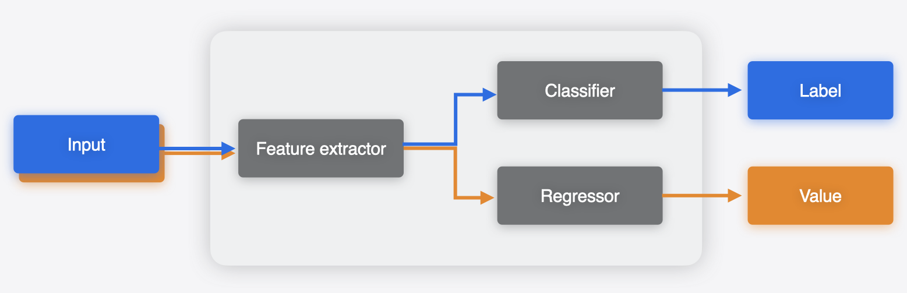
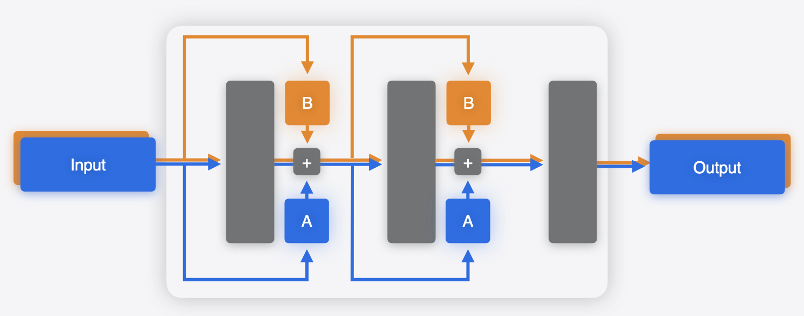

```{eval-rst}
.. index:: 
    single: multifunction model
```

# Multifunction Models

An `mlprogram` Core ML model typically contains a single function, called "main". 
This is the default form in which a model is constructed, say when its produced via 
the conversion process. Starting with `iOS18`/`macOS15`, you can produce an mlprogram 
with multiple functions in it. 
Each function, indexed by its unique name, can then be independently 
loaded and invoked for inference.

Consider a scenario, where you have separate models that 
share weights and run in the same app. 
For example, as illustrated in the following figure, one model
may have a feature extractor, 
followed by a classifier to produce a classification output. 
Another model may use the same feature extractor, 
followed by a regressor to produce the regression output.


Using Core ML Tools, you can merge these models to produce a 
single `.mlpackage` asset, with multiple functions, 
such that the common weights (feature extractor in this case) are shared between those. 
During the process of merging, Core ML Tools deduplicates shared weights by 
calculating the hash of the weight values. 
The merged multifunction model can do both tasks based on the function chosen to run.




## Why Combine Models?

In the example above, the two models used a common backbone. 
While utilizing multifunctions and producing a single model asset is definitely
beneficial, there does exist a reasonable workaround in this case: 
simply breaking up the models into 3 sub models: backbone, classifier head and 
regressor head, and using two of them in sequence based on the use case. 

However, there are scenarios when such a workaround would not be available. 
An example of this is the case of parameter efficient fine-tuning (PEFT),
which is a common approach for specializing large models to particular tasks. 
In the case of PEFT, "adapters" are attached to the base model, typically 
at multiple points within the network (as shown in the 
figures below), and only the parameters in these adapters 
are fine-tuned for a specific task. This is much more efficient than fine-tuning
the whole base model which has many more parameters.

```{figure} images/multifunction-adapter-1.png
:alt: Multifunction adapter 1
:width: 350
:align: left
```

```{figure} images/multifunction-adapter-2.png
:alt: Multifunction adapter 2
:width: 350
```

In this case, you can use a multifunction model to 
capture the multiple variations in a single model. 
A separate function could be defined for each adapter. 
The weights for the base model will be shared. 



For an example, see the “Deploy machine learning and AI models on-device with Core ML” 
[session video](https://developer.apple.com/videos/play/wwdc2024/10161/) in WWDC 2024
to learn more about integrating multifunction models into your app. 
It includes a text-to-image example in which a single 
model with multiple adapters is used to generate images with different styles. 


## Combining models: toy example with LoRA adapters

Lets define base model with two linear layers

```python
import torch # torch==2.3.0
import torch.nn as nn

class Base(nn.Module):
    def __init__(self):
        super(Base, self).__init__()
        self.linear1 = nn.Linear(6000, 6000)
        self.relu = nn.ReLU()
        self.linear2 = nn.Linear(6000, 6000)

    def forward(self, x):
        x = self.linear1(x)
        x = self.relu(x)
        x = self.linear2(x)
        return x

base_model = Base()
```

Now lets update this model by attaching to it, 
one of the most common type of adapter, i.e. [LoRA](https://huggingface.co/docs/peft/en/package_reference/lora) 
(low rank approximation), and 
convert the model. 
We will use the HuggingFace [peft](https://github.com/huggingface/peft) 
package to do so. 

```python
from peft import get_peft_model, LoraConfig # peft==0.11.1
```

```python
def adapt_model_with_lora(model):
    lora_config = LoraConfig(target_modules=["linear1", "linear2"], r=32, lora_alpha=1) # rank 32 
    adapted_model = get_peft_model(model, lora_config)
    return adapted_model
```

```python
adapted_model_1 = adapt_model_with_lora(base_model)
```

At this stage you would typically fine tune the model. We will skip that, 
since this is an illustrative example, 
and directly go the next stage of converting the model.

```python
import coremltools as ct 

mlmodel_1 = ct.convert(torch.jit.trace(adapted_model_1.eval(), torch.rand(1, 6000)), 
                       inputs=[ct.TensorType(name="input_adpated_model_1", shape=(1, 6000))],
                       outputs=[ct.TensorType(name="out_adpated_model_1")],
                       minimum_deployment_target=ct.target.iOS18,
                      )
mlmodel_1.save("adapted_model_1.mlpackage")
```

Now lets create a different adapter model, 
which we would in practice fine tune to a different task. 

```python
adapted_model_2 = adapt_model_with_lora(base_model)
mlmodel_2 = ct.convert(torch.jit.trace(adapted_model_2.eval(), torch.rand(1, 6000)), 
                       inputs=[ct.TensorType(name="input_adpated_model_2", shape=(1, 6000))],
                       outputs=[ct.TensorType(name="out_adpated_model_2")],
                       minimum_deployment_target=ct.target.iOS18,
                      )
mlmodel_2.save("adapted_model_2.mlpackage")
```

If we want to deploy both these variants of models in a 
single app, we can combine them into a single model.
This can be done by creating a `MultiFunctionDescriptor` 
to specify what models to merge and the new function name in the merged model. 
You can then use the `save_multifunction` 
utility to produce a merged multifunction Core ML model.

```python
desc = ct.utils.MultiFunctionDescriptor()

desc.add_function(
    "adapted_model_1.mlpackage",
    src_function_name="main",
    target_function_name="adapter_1"
)
desc.add_function(
    "adapted_model_2.mlpackage",
    src_function_name="main",
    target_function_name="adapter_2"
)

desc.default_function_name = "adapter_1"
ct.utils.save_multifunction(desc, "combined_adpater_models.mlpackage")
```

When loading the multifunction model, you can specify the 
`function_name` to load the specific function and then do the prediction:

```python
import numpy as np 

mlmodel_1 = ct.models.MLModel("combined_adpater_models.mlpackage")  # Uses default function
y_1 = mlmodel_1.predict({'input_adpated_model_1': np.random.rand(1, 6000)})

mlmodel_2 = ct.models.MLModel("combined_adpater_models.mlpackage", function_name="adapter_2")
y_2 = mlmodel_2.predict({'input_adpated_model_2': np.random.rand(1, 6000)})
```

The number of parameters in the base model are roughly 72M (6000x6000 = 36M 
for each of the two linear layers) (ignoring the bias vectors). 
LoRA adapters that we have used here, of rank 32, will attach 
two linear layers of shapes, (6000, 32) and (32, 6000), to each of 
the linear modules in the base model. 
This will result in 4x6000x32 = 0.768M parameters to be added, 
which is a fraction of the base model. 
The combined model will share the 72M parameters of 
the based model and only have the additional adapter parameters. 
We can see this in the model sizes:

```{figure} images/multifunction_model_sizes_lora_example.png
:alt: Model sizes LoRA toy example
:width: 440
:align: center
```

This is how the model interface for a multifunction model 
would show up in the Xcode predictions tab: 

```{figure} images/multifunction_input_output_xcode_adapted_model_1.png
:alt: Multifunction adapter 1
:width: 360
:height: 360
:align: left
```

```{figure} images/multifunction_input_output_xcode_adapted_model_2.png
:alt: Multifunction adapter 2
:width: 360
:height: 360
```


```{note}
The multifunction model feature is available starting with 
`iOS18`/`macOS15` for the `mlprogram` model type. 
```

**Tip**: 
You can specify the `function_name` argument when loading a 
[`CompiledMLModel`](https://apple.github.io/coremltools/source/coremltools.models.html#compiled-mlmodel) 
as well.  


