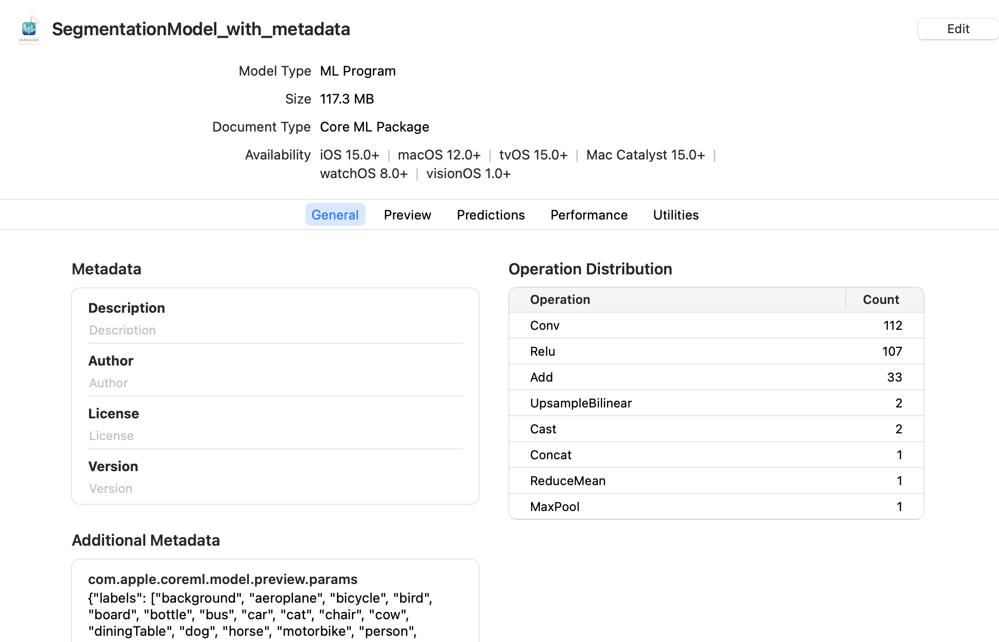
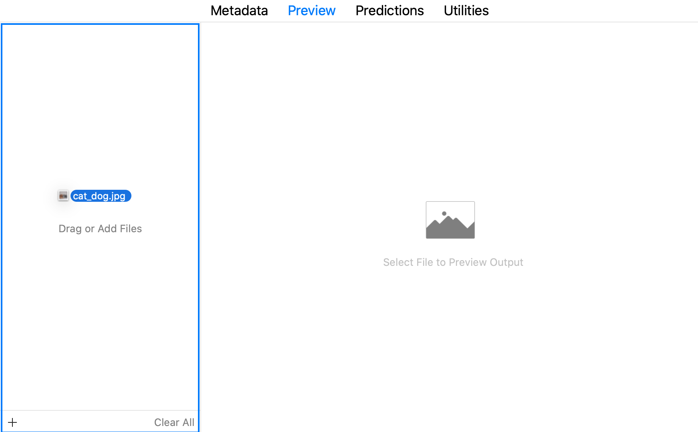

```{eval-rst}
.. index:: 
    single: PyTorch; convert segmentation model
```

# Converting a PyTorch Segmentation Model

This example demonstrates how to convert a PyTorch [segmentation model](https://pytorch.org/hub/pytorch_vision_deeplabv3_resnet101/ "DeepLabV3 model with a ResNet-101 backbone") to a Core ML neural network. The model takes an image and outputs a class prediction for each pixel of the image.

## Install the Required Software

Install the following:

```shell
pip install torch==1.6.0
pip install torchvision==0.7.0
pip install coremltools
```

## Load the Model and Image

To import code modules, load the segmentation model, and load the sample image, follow these steps:

1. Add the following `import` statements:
	
	```python
	import urllib
	import warnings
	warnings.simplefilter(action='ignore', category=FutureWarning)

	import torch
	import torch.nn as nn
	import torchvision
	import json

	from torchvision import transforms
	from PIL import Image

	import coremltools as ct
	```

2. Load the [DeepLabV3 model](https://pytorch.org/hub/pytorch_vision_deeplabv3_resnet101/ "DeepLabV3 model with a ResNet-101 backbone") (`deeplabv3`) segmentation model:
	
	```python
	model = torch.hub.load('pytorch/vision:v0.6.0', 'deeplabv3_resnet101', pretrained=True).eval()
	```

3. Load the sample image:
	
	```python
	input_image = Image.open("cat_dog.jpg")
	input_image.show()
	```

```{figure} images/cat_dog.jpg
:alt: Dog and cat test image
:align: center
:class: imgnoborder

Right-click and choose **Save Image** to download this test image.
```

## Normalize and Segment the Image

1. Apply normalization to the image using the [PASCAL VOC](http://host.robots.ox.ac.uk/pascal/VOC/ "The PASCAL Visual Object Classes") mean and standard deviation values, which were applied to the model's training data. The following converts the image to a form that works with the segmentation model for testing the model's output.
	
	```python
	preprocess = transforms.Compose([
		transforms.ToTensor(),
		transforms.Normalize(
			mean=[0.485, 0.456, 0.406],
			std=[0.229, 0.224, 0.225],
		),
	])

	input_tensor = preprocess(input_image)
	input_batch = input_tensor.unsqueeze(0)
	```

2. Get predictions from the model. Running the normalized image through the model will compute a score for each object class per pixel, and the class will be assigned with a maximum score for each pixel.
	
	```python
	with torch.no_grad():
		output = model(input_batch)['out'][0]
	torch_predictions = output.argmax(0)
	```

3. Plot the predictions, overlayed with the original image:
	
	```python
	def display_segmentation(input_image, output_predictions):
		# Create a color pallette, selecting a color for each class
		palette = torch.tensor([2 ** 25 - 1, 2 ** 15 - 1, 2 ** 21 - 1])
		colors = torch.as_tensor([i for i in range(21)])[:, None] * palette
		colors = (colors % 255).numpy().astype("uint8")

		# Plot the semantic segmentation predictions of 21 classes in each color
		r = Image.fromarray(
			output_predictions.byte().cpu().numpy()
		).resize(input_image.size)
		r.putpalette(colors)

		# Overlay the segmentation mask on the original image
		alpha_image = input_image.copy()
		alpha_image.putalpha(255)
		r = r.convert("RGBA")
		r.putalpha(128)
		seg_image = Image.alpha_composite(alpha_image, r)
		seg_image.show()

	display_segmentation(input_image, torch_predictions)
	```

```{figure} images/seg_pytorch.png
:alt: Plot predictions overlayed with image
:align: center
:class: imgnoborder

Plotting the predictions overlayed with the original image.
```


## Trace the Model with Sample Input

Now that the PyTorch model is segmenting the image correctly, you can trace the PyTorch model using the cat and dog image (`cat_dog.jpg`) as input. A random input of the same shape also works.

However, the model returns a dictionary. If you try to use `trace = torch.jit.trace(model, input_batch)` without first extracting the output you want from the dictionary, the tracer outputs an error: `Only tensors or tuples of tensors can be output from traced functions`.

To sidestep this limitation, you can wrap the model in a module that extracts the output  from the dictionary:

```python
class WrappedDeeplabv3Resnet101(nn.Module):

    def __init__(self):
        super(WrappedDeeplabv3Resnet101, self).__init__()
        self.model = torch.hub.load(
            'pytorch/vision:v0.6.0',
            'deeplabv3_resnet101',
            pretrained=True
        ).eval()

    def forward(self, x):
        res = self.model(x)
        # Extract the tensor we want from the output dictionary
        x = res["out"]
        return x
```

Now the trace runs without errors:

```python
traceable_model = WrappedDeeplabv3Resnet101().eval()
trace = torch.jit.trace(traceable_model, input_batch)
```

## Convert the Model

Follow these steps:

1. Pass in the traced model to [`convert()`](https://apple.github.io/coremltools/source/coremltools.converters.convert.html#module-coremltools.converters._converters_entry) to produce a neural network model, and include the inputs to provide to the model:
	
	```python
	mlmodel = ct.convert(
		trace,
		inputs=[ct.TensorType(name="input", shape=input_batch.shape)],
	)
	```
	
	``` {note}
	This example includes a name for the output to make it easier to extract from the Core ML model's prediction dictionary. To learn more about input options, see [Flexible Input Shapes](flexible-inputs).
	```

2. Save the neural network model with the `.mlmodel` extension:
	
	```python
	mlmodel.save("SegmentationModel_no_metadata.mlmodel")
	```

```{eval-rst}
.. index:: 
    single: PyTorch; set model metadata
    single: metadata; PyTorch model
```


## Set the Model's Metadata

Set the model's metadata for previewing in Xcode, as described in [Xcode Model Preview Types](xcode-model-preview-types). Follow these steps:

1. Load the converted model from the previous step.
2. Set up the parameters. This example collects them in `labels_json`.
3. Define the `model.preview.type` metadata as `"imageSegmenter"`.
4. Define the `model.preview.parameters` as `labels_json`.
5. Save the model.

```python
# load the model
mlmodel = ct.models.MLModel("SegmentationModel_no_metadata.mlmodel")

labels_json = {"labels": ["background", "aeroplane", "bicycle", "bird", "board", "bottle", "bus", "car", "cat", "chair", "cow", "diningTable", "dog", "horse", "motorbike", "person", "pottedPlant", "sheep", "sofa", "train", "tvOrMonitor"]}

mlmodel.user_defined_metadata["com.apple.coreml.model.preview.type"] = "imageSegmenter"
mlmodel.user_defined_metadata['com.apple.coreml.model.preview.params'] = json.dumps(labels_json)

mlmodel.save("SegmentationModel_with_metadata.mlmodel")
```

```{eval-rst}
.. index:: 
    single: Xcode; preview
    single: preview in Xcode
```

## Open the Model in Xcode

Double-click the saved `SegmentationModel_with_metadata.mlmodel` file in the Mac Finder to launch Xcode and open the model information pane:



The sample model offers tabs for **Metadata**, **Preview**, **Predictions**, and **Utilities**. Click the **Predictions** tab to see the model’s input and output:


```{note}

The preview for a segmentation model is available in Xcode 12.3 or newer.
```

To preview the model’s output for a given input, follow these steps:

1. Click the **Preview** tab.
2. Drag an image into the image well on the left side of the model preview:



The result appears in the preview pane:

```{figure} images/xcode-segment-preview2-crop.png
:alt: Preview pane
:align: center
:class: imgnoborder

The preview pane.
```


```{tip}

To use the model with an Xcode project, drag the model file to the Xcode Project Navigator. Choose options if you like, and click **Finish**. You can then select the model in the Project Navigator to show the model information. For more information about using Xcode, see the [Xcode documentation](https://developer.apple.com/documentation/xcode "Xcode documentation").
```


## Example Code

The following is the full code for the segmentation model conversion.

Requirements:

```shell
pip install torch==1.6.0
pip install torchvision==0.7.0
pip install coremltools
```

Python code:

```python
import urllib
import warnings
warnings.simplefilter(action='ignore', category=FutureWarning)

import torch
import torch.nn as nn
import torchvision
import json

from torchvision import transforms
from PIL import Image

import coremltools as ct

# Load the model (deeplabv3)
model = torch.hub.load('pytorch/vision:v0.6.0', 'deeplabv3_resnet101', pretrained=True).eval()

# Load a sample image (cat_dog.jpg)
input_image = Image.open("cat_dog.jpg")
input_image.show()

preprocess = transforms.Compose([
    transforms.ToTensor(),
    transforms.Normalize(
        mean=[0.485, 0.456, 0.406],
        std=[0.229, 0.224, 0.225],
    ),
])

input_tensor = preprocess(input_image)
input_batch = input_tensor.unsqueeze(0)

with torch.no_grad():
    output = model(input_batch)['out'][0]
torch_predictions = output.argmax(0)

def display_segmentation(input_image, output_predictions):
    # Create a color pallette, selecting a color for each class
    palette = torch.tensor([2 ** 25 - 1, 2 ** 15 - 1, 2 ** 21 - 1])
    colors = torch.as_tensor([i for i in range(21)])[:, None] * palette
    colors = (colors % 255).numpy().astype("uint8")

    # Plot the semantic segmentation predictions of 21 classes in each color
    r = Image.fromarray(
        output_predictions.byte().cpu().numpy()
    ).resize(input_image.size)
    r.putpalette(colors)

    # Overlay the segmentation mask on the original image
    alpha_image = input_image.copy()
    alpha_image.putalpha(255)
    r = r.convert("RGBA")
    r.putalpha(128)
    seg_image = Image.alpha_composite(alpha_image, r)
    # display(seg_image) -- doesn't work
    seg_image.show()

display_segmentation(input_image, torch_predictions)

# Wrap the Model to Allow Tracing*
class WrappedDeeplabv3Resnet101(nn.Module):
    
    def __init__(self):
        super(WrappedDeeplabv3Resnet101, self).__init__()
        self.model = torch.hub.load('pytorch/vision:v0.6.0', 'deeplabv3_resnet101', pretrained=True).eval()
    
    def forward(self, x):
        res = self.model(x)
        x = res["out"]
        return x
        
# Trace the Wrapped Model
traceable_model = WrappedDeeplabv3Resnet101().eval()
trace = torch.jit.trace(traceable_model, input_batch)

# Convert the model
mlmodel = ct.convert(
    trace,
    inputs=[ct.TensorType(name="input", shape=input_batch.shape)],
)

# Save the model without new metadata
mlmodel.save("SegmentationModel_no_metadata.mlmodel")

# Load the saved model
mlmodel = ct.models.MLModel("SegmentationModel_no_metadata.mlmodel")

# Add new metadata for preview in Xcode
labels_json = {"labels": ["background", "aeroplane", "bicycle", "bird", "board", "bottle", "bus", "car", "cat", "chair", "cow", "diningTable", "dog", "horse", "motorbike", "person", "pottedPlant", "sheep", "sofa", "train", "tvOrMonitor"]}

mlmodel.user_defined_metadata["com.apple.coreml.model.preview.type"] = "imageSegmenter"
mlmodel.user_defined_metadata['com.apple.coreml.model.preview.params'] = json.dumps(labels_json)

mlmodel.save("SegmentationModel_with_metadata.mlmodel")
```

