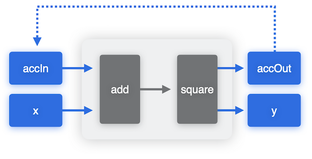
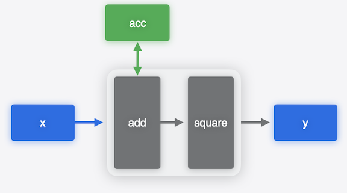

```{eval-rst}
.. index:: 
    single: stateful model
    single: transformer
```

# Stateful Models

This section introduces how Core ML models support stateful prediction. 
Starting from `iOS18` / `macOS15`, Core ML models can have a *state* input type. 
With a *stateful model*, you can keep track of specific  intermediate values 
(referred to as *states*), by persisting and updating them across 
inference runs. The model can implicitly read data from a state, and write back to a state.

## Example: A Simple Accumulator

To illustrate how stateful models work, we can
use a toy example of an accumulator that keeps track of the sum 
of its inputs, and the output is a square of the input + accumulator. 
One way to create this model is to explicitly have accumulator inputs and outputs,
as shown in the following figure. To run prediction with this model, we explicitly
provide the accumulator as an input, get it back as the output and copy over 
its value to the input for the next prediction.

```python
# prediction code with stateless model

acc_in = 0
y_1, acc_out = model(x_1, acc_in)
acc_in = acc_out
y_2, acc_out = model(x_2, acc_in)
acc_in = acc_out
...
```



With stateful models you can read and write the accumulator state directly. You don’t need to define them as inputs or outputs and copy them explicitly from output of the previous prediction to the input of the next prediction call. The model takes care of updating the value implicitly.

```python
# prediction code with stateful model

acc = initialize
y_1 = model(x_1, acc)
y_2 = model(x_2, acc)
...
```



Using stateful models in Core ML is convenient because it simplifies your code, 
and it leaves the decision on how to update the state to the 
model runtime, which maybe more efficient.

State inputs show up alongside the usual model inputs in the Xcode UI as shown in 
the snapshot below.


## Registering States for a PyTorch Model

To set up a PyTorch model to be converted to a Core ML stateful model, the first step is to use the [`register_buffer`](https://pytorch.org/docs/stable/generated/torch.nn.Module.html#torch.nn.Module.register_buffer) API in PyTorch to register buffers in the model to use as state tensors.

For example, the following code defines a model to demonstrate an accumulator, and registers the `accumulator` buffer as the state:

```python
import numpy as np
import torch

import coremltools as ct

class Model(torch.nn.Module):
    def __init__(self):
        super().__init__()
        self.register_buffer("accumulator", torch.tensor(np.array([0], dtype=np.float16)))

    def forward(self, x):
        self.accumulator += x
        return self.accumulator * self.accumulator

```


## Converting to a Stateful Core ML Model

To convert the model to a stateful Core ML model, 
use the `states` parameter 
with `convert()` 
to define a [`StateType`](https://apple.github.io/coremltools/source/coremltools.converters.mil.input_types.html#coremltools.converters.mil.input_types.StateType) 
tensor using the same state name 
(`accumulator`) that was used with `register_buffer` :

```python
traced_model = torch.jit.trace(Model().eval(), torch.tensor([1]))
mlmodel = ct.convert(
    traced_model,
    inputs = [ ct.TensorType(shape=(1,)) ],
    outputs = [ ct.TensorType(name="y") ],
    states = [
        ct.StateType(
            wrapped_type=ct.TensorType(
                shape=(1,),
            ),
            name="accumulator",
        ),
    ],
    minimum_deployment_target=ct.target.iOS18,
)
```

```{note}
The stateful models feature is available starting with `iOS18`/`macOS15` for the `mlprogram` model type.
Hence, during conversion, the minimum deployment target must be provided accordingly. 
```

## Using States with Predictions

Use the [`make_state()`](https://apple.github.io/coremltools/source/coremltools.models.html#coremltools.models.model.MLModel.make_state) 
method of MLModel to initialize the state, which you can then pass to the 
[`predict()`](https://apple.github.io/coremltools/source/coremltools.models.html#coremltools.models.model.MLModel.predict) 
method as the `state` parameter. This parameter is passed by reference; 
the state isn’t saved to the model. You can use one state, 
then use another state, and then go back to the first state, as shown in the following example.

```python 
state1 = mlmodel.make_state()

print("Using first state")
print(mlmodel.predict({"x": np.array([2.])}, state=state1)["y"]) # (2)^2 
print(mlmodel.predict({"x": np.array([5.])}, state=state1)["y"]) # (5+2)^2
print(mlmodel.predict({"x": np.array([-1.])}, state=state1)["y"]) # (-1+5+2)^2
print()

state2 = mlmodel.make_state()

print("Using second state")
print(mlmodel.predict({"x": np.array([9.])}, state=state2)["y"]) # (9)^2 
print(mlmodel.predict({"x": np.array([2.])}, state=state2)["y"]) # (2+9)^2
print()

print("Back to first state")
print(mlmodel.predict({"x": np.array([3.])}, state=state1)["y"]) #(3-1+5+2)^2
print(mlmodel.predict({"x": np.array([7.])}, state=state1)["y"]) #(7+3-1+5+2)^2
```

```text Output
Using first state
[4.]
[49.]
[36.]

Using second state
[81.]
[121.]

Back to first state
[81.]
[256.]
```

```{warning}
Comparing torch model's numerical outputs with the converted Core ML stateful 
model outputs to verify numerical match has to be done carefully, as 
running it more than once changes the value of the state and hence the outputs accordingly. 
```

```{note}
In the Core ML Tools Python API, state values are opaque. 
You can get a new state and pass a state to `predict`, 
but you cannot inspect the state or change values of tensors in the state.
However [APIs](https://developer.apple.com/documentation/coreml/mlstate) 
in the Core ML Framework allow to inspect and modify the state.     
```

## Creating a Stateful Model in MIL

You can use the [Model Intermediate Language](https://apple.github.io/coremltools/docs-guides/source/model-intermediate-language.html) (MIL) to create a stateful model directly from MIL ops. Construct a MIL program using the Python [`Builder`](https://apple.github.io/coremltools/source/coremltools.converters.mil.html#module-coremltools.converters.mil.mil) class for MIL as shown in the following example, which creates a simple accumulator:

```
import coremltools as ct
from coremltools.converters.mil.mil import Builder as mb, types

@mb.program(input_specs=[mb.TensorSpec((1,), dtype=types.fp16), 
                         mb.StateTensorSpec((1,), dtype=types.fp16),],)
def prog(x, accumulator_state):
    # Read state
    accumulator_value = mb.read_state(input=accumulator_state)
    # Update value
    y = mb.add(x=x, y=accumulator_value, name="y")
    # Write state
    mb.coreml_update_state(state=accumulator_state, value=y)

    return y

mlmodel = ct.convert(prog,minimum_deployment_target=ct.target.iOS18)
```

The result is a stateful Core ML model (`mlmodel`), converted from the MIL representation.


## Applications

Using state input types can be convenient for working with models that 
require storing some intermediate values, updating them and then reusing them
in subsequent predictions to avoid extra computations. 
One such example of a model is a language model (LM) that uses the [transformer 
architecture](https://en.wikipedia.org/wiki/Transformer_(deep_learning_architecture))
and attention blocks. An LM typically works by digesting sequences of 
input data and producing output tokens in an 
auto-regressive manner: that is, producing one output token at a time, 
updating some internal state in the process, 
using that token and updated state to do the next prediction to produce the next output
token, and so on. 

In the case of a transformer, 
which involves three large tensors 
that the model processes : "Query", "Key", and "Value", a common 
optimization strategy is to avoid extra computations at token generation time
by caching the "Key" and "Value" tensors and updating them incrementally to be reused in 
each iteration of processing new tokens. 
This optimization can be applied to Core ML models by making the Key-Values, 
as explicit inputs/outputs of the model.
Here is where State model types can also be utilized for more convenience and
potential runtime performance improvements. 
For instance, please check out the [2024 WWDC session](https://developer.apple.com/videos/play/wwdc2024/10159/) for an 
example that uses the [Mistral 7B model](https://huggingface.co/mistralai/Mistral-7B-Instruct-v0.2)
and utilizes the stateful prediction feature for improved performance on a GPU on a macbook pro.  


